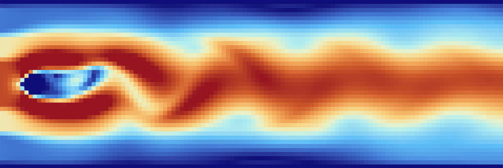

# Numeric Simulation Project
This is the repository for the numeric simulation project of the Numerical Simulation lecture at the University of Stuttgart. The project implements a 2D incompressible Navier-Stokes solver using the Finite Difference Method (FDM) with different solvers and parallelization techniques. 


See some demonstration videos in the Task4/scenarios/ folder.


## Project Structure
- **Task 1:** Serial computation of the Navier Stokes solver. See more in `Task1/`.
- **Task 2:** Parallel computation using MPI. See more in `Task2/`.
- **Task 3:** Predict the lid driven cavity flow by training a neural network on simulation data. See more in `Task3/`.
- **Task 4 (final project):** Implementing generalised geometries and boundary conditions in parallel. See more in `Task4/`.

The state of the code after each task submission can be found by switching to the respective git tag / release.

## Quick start to run the code for different tasks:
- **Task 1:**
    - change ```main.cpp``` to use the computation.hpp class
    - run ```./set_up_and_cmake.sh``` to setup and cmake the code
    - run ```./build/numsim_parallel lid_driven_cavity.txt``` to run the serial code with the lid driven cavity scenario
- **Task 2:** 
    - change ```main.cpp``` to use the parallelComputation.hpp class
    - run ```./set_up_and_cmake.sh``` to setup and cmake the code
    - run ```mpirun -n 4 ./build/numsim_parallel lid_driven_cavity.txt``` to run on 4 processes with the lid driven cavity scenario
- **Task 3:**
    - How to train and use the model neural network can be found in the pdf files in the Task3/ folder.
- **Task 4:**
    - change ```main.cpp``` to use the domainComputation.hpp class
    - run ```./set_up_and_cmake.sh``` to setup and cmake the code
    - run ```mpirun -n 4 ./build/numsim_parallel Task4/scenarios/lid_driven_cavity.txt``` to run on 4 processes with the lid driven cavity scenario. For this, the lid driven cavity scenario file has to be in the Task4/scenarios/ folder as well as the .domain file. 
    - In the folder Task4/scenarios/ there are more scenarios to try out.
    - The .domain file with the geometry and boundary conditions is always specified in the scenario text file. This means only the scenario text file has to be given as input to the executable.

### Visualization of results (paraview):
- The output files are located in the out/ folder from where the code was run.
- .vti files are stored 30 times per simulated second in that folder.
- These files can be opened as a group with paraview for visualization.

## Workspace setup for WSL (follow docs of numsim lecture)
- install g++ and gdp: ```sudo apt-get install build-essential gdb```
- ```sudo apt install cmake```
- ```sudo apt install libvtk9-dev```
- ```sudo apt install qtbase5-dev qttools5-dev qttools5-dev-tools qt5-qmake libqt5opengl5-dev```
- ```sudo apt install openjdk-17-jdk```
- server jdk path to .bashrc : ```export LD_LIBRARY_PATH=$LD_LIBRARY_PATH:/usr/lib/jvm/java-17-openjdk-amd64/lib:/usr/lib/jvm/java-17-openjdk-amd64/lib/server```
- lib path to .profile at the end via sudo nano (same path) -> might be redundant
- paraview installation via https://www.paraview.org/download/ 


## Compile and run the code:
- make sure the build/ folder is empty and exists
- run ```cmake ..``` from build/ folder: This should create the Makefile in build/ folder
- run ```make install``` from build/ folder: This compiles the code and creates the ./numsim executable in build/ folder
- run this executable ```./numsim``` from build/ folder:
this should create the outputs in build/out/
- cmake nur machen, wenn sich die CMakeLists.txt ändert, also wenn man dateien hinzufügt oder entfernt
- wenn das nicht der fall ist einfach schnell machen: ```make install``` und dann ```./numsim``` oder direkt ```make install && ./numsim```

## Inspect the code and performance (gprof):
- put gprof in the cmakelist:
- compile with ```cmake -DPROFILE=ON ..```
- make install
- run like usual
- use gprof to make text file: 
    - on function level: ```gprof numsim_parallel > out1.txt```
    - on code line level: ```gprof -l numsim_parallel > out2.txt```
- use tool to visualize this graphically

## To run the code on the IPVS cluster:
To be able to access the ipvslogin.informatik.uni-stuttgart.de server you have to not only be in the uni eduroam network via the normal vpn, but in the informatics network via their vpn.
1) get into the informatics network (vpn.informatik.uni-stuttgart.de)
2) ssh into the ipvs cluster ```ssh -X [user]@ipvslogin.informatik.uni-stuttgart.de```
3) ssh into simcl1 computer ```ssh -X simcl1```. This home directory is synced with the one on the login server. So you can access your files from both computers.
4) Pull, compile and run the code on simcl1 just like on your local machine but using the module system to load the required compilers and libraries.
    - To compile the code on the cluster one has to use the module system there to load the required compilers and libraries. ```module load gcc/10.2 openmpi/3.1.6-gcc-10.2 vtk/9.0.1 cmake/3.18.2```
    - Use slurm to submit jobs as described in [https://numsim-exercises.readthedocs.io/en/latest/exercise2/cluster.html](https://numsim-exercises.readthedocs.io/en/latest/exercise2/cluster.html). Cheatsheet for slurm commands: ```sinfo```, ```squeue```, ```sbatch jobscript.sh```, ```scancel [jobID]```

### get into the informatics network:
- one can use the normal cisco anyconnect vpn to connect to the informatics network
- but you have to download the informatics network certificate from [http://www.zdi.uni-stuttgart.de/zdi/vpn/anyconnect.html](http://www.zdi.uni-stuttgart.de/zdi/vpn/anyconnect.html) (from within the informatics network for example by accessing the informatics computer pool)
- then install the certificate in windows according to the instructions on the website.
- to be able to access the informatics computer pool and then the vpn in vpn.informatik.uni-stuttgart.de you have to use you informatics login which is different from your ipvs cluster login


## Helpful links:
- [https://numsim-exercises.readthedocs.io/en/latest/exercise1/index.html](https://numsim-exercises.readthedocs.io/en/latest/exercise1/index.html)
- [https://ipvs.informatik.uni-stuttgart.de/SGS/numsim/ex1_doxygen/annotated.html](https://ipvs.informatik.uni-stuttgart.de/SGS/numsim/ex1_doxygen/annotated.html)
- Submission system: https://opendihu-ci.informatik.uni-stuttgart.de/numsim/